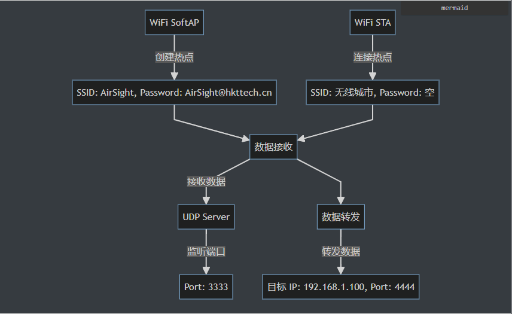
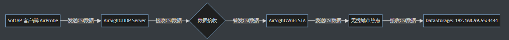

/**
 * @brief: AirSight
 * @author: 伍志勇
 * @date: 2025-02-18
 * 
 # 概要设计：
 ## 1、WiFi 初始化：
 *      使用 esp_wifi_init 初始化 WiFi。
 *      配置 SoftAP 和 STA 模式。
 *      注册 WiFi 事件处理函数，处理 STA 连接和断开事件。
 ## 2、WiFi 事件处理：
 *      当 STA 启动时，自动连接 WiFi 热点。
 *      在 STA 连接成功后，获取其 IP 地址。注：只有在 STA 成功获取 IP 地址后，才会尝试转发数据。
 *      当 STA 断开连接时，等待 3 秒后重试。
 ## 3、UDP 服务器：
 *      创建一个 UDP socket，绑定到端口 3333。
 *      接收CSI数据：使用 recvfrom 接收来自客户端的数据，并打印到日志。
 *      转发CSI数据：将接收到的数据通过 UDP 发送到指定的 IP 和端口。
 ## 4、任务调度：
 *      使用 FreeRTOS 创建 UDP 服务器任务。
 
 ## 5、注意事项
 * 1）WiFi 配置：
 *      确保 无线城市 热点没有密码，或者根据实际情况修改代码。
 *      确保 FORWARD_IP 和 FORWARD_PORT 设置正确，且目标设备在同一个局域网中。
 * 2）UDP 数据接收：
 *      接收的数据长度不能超过 rx_buffer 的大小（1024 字节）。
 * 3）调试：
 *      使用 ESP_LOGI 打印日志，方便调试和观察程序运行状态。
 

 # 设计图：
 ## 1、功能架构

## 2、数据流图

